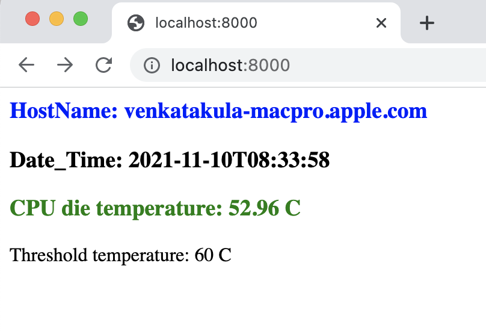

# py-refresh-powermetrics
This project demonstrates:
+ Simple HTTP server displaying few system metrics
+ Refreshes webpage at specified time intervals

### System requirements
+ MacBook
+ Web browser
+ Python 3

### List of files
+ display_mac_cpu_temperature.py
+ refreshUrl.py

### Run project
+ First run display_mac_cpu_temperature.py (from IDE or CLI)
+ Then refreshUrl.py - this opens the webpage displaying hostname, current timestamp and CPU temperature and refreshes the page at specified time intervals
+ When the temperature is above threshold limit
   - it is displayed in red color and
   - generates voice message
+ Press ^C to terminate each of the program

### Sample output

